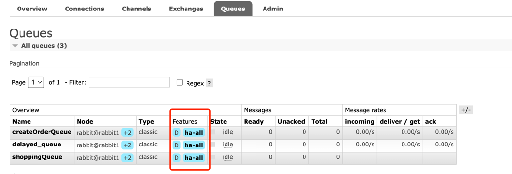
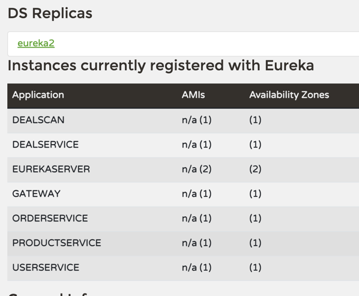
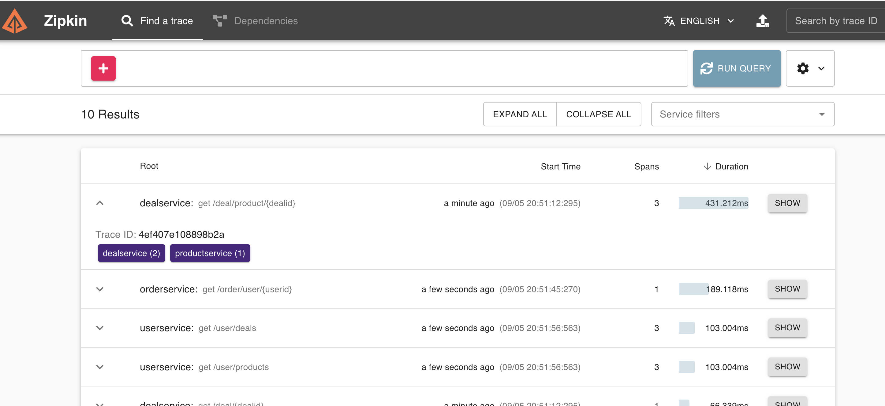
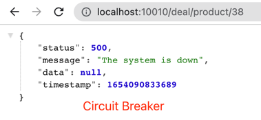

# High-availability-shopping-system
A high availability shopping(e-commerce) system with high concurrency using SpringBoot, Spring Cloud(Microservices architecture), Spring Cloud Gateway, MySQL, resillience4j, Openfeign, Spring Security, RabbitMQ, Redis, Bloom Filter, Zipkin and Sleuth. The front end is implemented using Angular.
# Main Functions shown on the website

- **User Login**
  - Three example users are provided.
  - Orders could be viewed through `MY PROFILE`
- **Deals and Products**
  - Deals and products are shown on the pages.
- **Purchase restriction**
  - Each item can only be bought **once** per user.
- **Order cancellation policy**
  - Orders will be cancelled by the system in **5 minutes** if users do not pay.
- **Error handler**
  - User-friendly error pages. There are a few reasons for showing error pages.
    - Deals/products not found.
    - Limits the access rate from users so that the servers will not crash.
    - When a service is down, protects the system.
- **Admin Login**
  - A simple admin page that allows the admin to add/start/end a deal.
  - link: `/admin/login`
  - default username: `admin`, password: `admin123`
# Back-end Tech

## MySQL & Mybatis
Mybatis is a framework supporting SQL for operating MySQL.

## Redis
Redis is used as a cache in this project due to its high throughput. Compared to MySQL, it can take advantage of the reading speed as a cache. In my project, Redis is responsible for storing deal and product information before the deal starts, then used to deal with a large number of requests for querying and updating deals. For instance, Redis would be able to update the number of items held and the number of available items in stock, and it would limit the number of an item that one user could buy as well.

Another usage is the locks in Lua. I used `eval()` to execute the Lua script, and the Lua will be considered as a command which is atomic. For instance, we can execute Lua scripts in Redis to implement distributed locks.

https://redis.com/ebook/part-3-next-steps/chapter-11-scripting-redis-with-lua/11-2-rewriting-locks-and-semaphores-with-lua/11-2-1-why-locks-in-lua/

In this project, keys in Redis are set to expire in 20 minutes, and expired or non-existent keys will be reset when checking the stock.

### Redis potential issues and solutions used in the project
#### Cache Breakdown
The key of a hot product expired, a large number of query requests for this product come into the database, and there would be a concurrency problem.

**Solution**: Using the **Redis distributed lock(Lua script)**.

#### Cache Penetration
A large number of requests for non-existent keys (not in Redis and MySQL) may make MySQL crash.

**Solution:** Using **Bloom Filter**. Bloom filter helps us to quickly figure out whether the items exist or not.

**Another Problem**: Some items may be deleted but the bloom filter has difficulty deleting keys. A scheduler may be used to rebuild the bloom filter.

#### Cache Avalanche

The same expiration times of keys in Redis are used. If all keys expire at the same time, all concurrent traffic goes directly to the database and leads to extensive pressure on the database.

**Solution:** Setting up a random expiration time.

## RabbitMQ ~~Kafka~~
I've changed Kafka to RabbitMQ since RabbitMQ is more suitable for the shopping site scenario - being able to implement delayed messages while Kafka cannot, even though I implemented a custom scheduler, there are still some unknown bugs.
In this project, RabbitMQ is used for slowing down the requests - putting them in a queue, and picking them by consumers one by one - so that MySQL will not get crashed when it comes to a large number of operations.
Also, a specific delayed Exchange(topic) and Queue were used to check the order status to make sure the order is finished within 5 minutes, otherwise, cancel the order.

RabbitMQ was deployed as a cluster to achieve **High Availability**, which is shown below.

~~I used Kafka in this project to implement a message queue. Kafka is doing excellent in the aspect of stream processing. In this project, Kafka is used for slowing down the requests - putting them in a queue, and picking them by consumers one by one - so that MySQL will not get crashed when it comes to a large number of operations. For the reason that Kafka has no function of delaying messages, I also implemented a task scheduler to finish the 15-minutes check for the order status.~~

## CDN
CDN(Content Delivery Network) could be used for storing static resources so that users could access websites faster.

## Spring Cloud Microservices 

I used two Spring Cloud **Eureka** servers as a registry to manage address for my services.

## Spring Cloud Gateway

>Spring Cloud Gateway provides a flexible way of routing requests based on a number of criteria, as well as focuses on cross-cutting concerns such as security, resiliency, and monitoring.

Since I haven't implemented any authentication parts, In this project, the Spring Cloud Gateway are mainly responsible for routing and implementing a CORS policy.

Moreover, inner APIs were prevented to be accessed from clients using Spring Cloud Gateway.

## OpenFeign

Microservices are communicating with each other using OpenFeign tech.

Load Balancer would be used when using OpenFeign (registered by Eureka servers).

## Spring Security
Used Spring Security to authenticate users(admin), and protect inner APIs being accessed by clients.

## Sleuth & ZipKin

>Zipkin and Sleuth allow us to aggregate and track log entries as requests move through a distributed software system

## resilience4j
I used the **Circuit Breaker** to protect the upstream services when downstream services are down.

I also used the **Rate Limiter** to limit the access rate from the clients so that the servers will not get crashed(e.g. simple implementation in the com.leih.shopping.model.Deal Service).

### Why use resilience4j?
- The downstream service may be down and the request will keep going to the downstream service, exhausting network resources, and slowing performances.
- Bad user experience
- The failure of one service could cascade to other services throughout the whole application.

# Front End - Angular

Done.